*FlatBars* — _bare rods_ — is not a template engine. It is the *substrate you build one on*.

It is two things, and only two things:

1. a *parser* that turns Handlebars/Mustache-style source into a *skeleton syntax tree* — pure
   structure, no meaning; and
1. a *contract* for the *second pass* — a validating, interpreting walk over that tree — that an
   engine supplies on top.

The split is the whole idea. Think *JSON and JSON Schema*: JSON fixes a uniform structural syntax
and knows nothing about what any document _means_; a schema is a separate pass that decides which
shapes are legal and what they stand for. FlatBars is the JSON; the engine you build is the schema
plus the interpreter.

## What makes it different

| Principle | What it means |
| --- | --- |
| The core has no semantics | The parser does not know what `if` does, whether output should be escaped, what a path is, or even that an identifier names a "helper." It produces `Content`, `Output`, and `Block` nodes and stops. All meaning is added by the [engine walk](/spec/evaluation/). |
| No built-in helpers, no keywords | `if`, `each`, `with`, `unless`, `lookup`, HTML escaping — and `else` — are *userland*. The core ships none of them and reserves no names. The [reference engine](/engine/prelude/), *FullBars*, reproduces Handlebars, but you can delete, replace, or rename any of it. |
| No sugar in the core | Dotted paths, `{{ }}` auto-escaping, `@`-variables, `as \|x\|`, partials — all of that lives in an *optional* [surface dialect](/engine/surface/) that compiles to the core skeleton. |
| Everything is a helper application | In the reference engine a bare identifier `{{{city}}}` *calls the helper* `city`. To read a data field you call a helper: `{{{lookup this "city"}}}`. No variables, no implicit context. |
| Application is juxtaposition; parens group | `{{{upcase (lookup this "name")}}}` is `upcase` applied to one argument; the parentheses *group* the nested application. The Handlebars subexpression model, used uniformly — not Lisp prefix. |
| `Value` is pure data | A value is a string, number, boolean, null, array, or object. *Never a function.* Values stay serializable; helpers live in a separate, scoped environment. |

## The two phases

```mermaid
flowchart TD
    S["<b>Surface dialect</b> (optional sugar)<br/>name · a.b.c · @index · ../x · as &#124;x&#124; · partials"]
    C["<b>PHASE 1 — FlatBars core</b><br/>lex + parse → skeleton AST<br/>structure only; no meaning, no else, no keywords"]
    P["<b>PHASE 2 — the engine walk</b> (you supply)<br/>validate + interpret the AST, like a JSON Schema<br/>helpers · arity · truthiness · escaping · clauses"]
    S -->|desugars to| C
    C -->|handed to| P
```

The [core model](/concepts/) explains the decisions. The
[appendix](/appendix/handlebars/) maps *every* Handlebars concept onto FlatBars with no gaps.

:::note
This document specifies the *core* (Phase 1) normatively, and the *contract* a Phase-2 engine must
satisfy. The [reference engine](/engine/prelude/) and [host API](/engine/host-api/) are one
conforming implementation, in PureScript. Code fragments use `text`/`haskell` blocks and are
normative only where marked _normative_.
:::

## The reference dialect: FullBars

The engine and surface dialect that ship with FlatBars are *FullBars* — a member of the
Handlebars/Mustache family, familiar on sight, but a *dialect* with its own reasoned choices, not a
clone: a helper-first core, escaping as an explicit helper, `{{else}}` as a name-agnostic
separator, a native short-circuit `{{elif}}`, content-based safe-string truthiness, and
explicit (`~`) whitespace. The differences from Handlebars are *features, not gaps* — see
[the FullBars dialect — differences from Handlebars](/engine/fullbars-compat/). And because the core
reserves no names, you can delete, replace, or rename any of it and grow a different dialect on the
same substrate.
